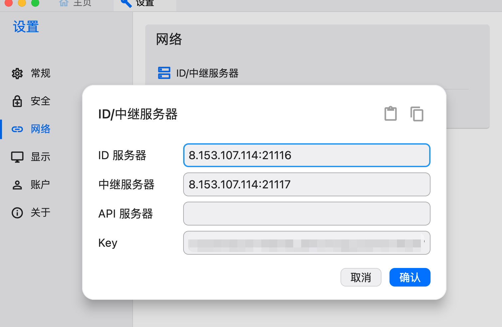

# docker-compose 安装rustserver


docker-compose.yaml
```
networks:
  rustdesk-net:
    external: false

services:
  hbbs:
    container_name: hbbs
    ports:
      - 21115:21115
      - 21116:21116
      - 21116:21116/udp
      - 21118:21118
    image: rustdesk/rustdesk-server:latest
    command: hbbs 
    volumes:
      - /root/docker/rustdesk/data/root:/root
    networks:
      - rustdesk-net
    depends_on:
      - hbbr
    restart: unless-stopped
    deploy:
      resources:
        limits:
          memory: 64M

  hbbr:
    container_name: hbbr
    ports:
      - 21117:21117
      - 21119:21119
    image: rustdesk/rustdesk-server:latest
    command: hbbr
    volumes:
      - /root/docker/rustdesk/data/root:/root
    networks:
      - rustdesk-net
    restart: unless-stopped
    deploy:
      resources:
        limits:
          memory: 64M
```

/root/docker/rustdesk/data/root  映射目录 可以自己修改，
映射IP 也可以自己修改  

```shell
# 执行安装
docker-compose pull && docker-compose -f docker-compose.yaml up -d
```

#### 查看生成的秘钥
cat /root/docker/rustdesk/data/root/id_xxxx.pub




